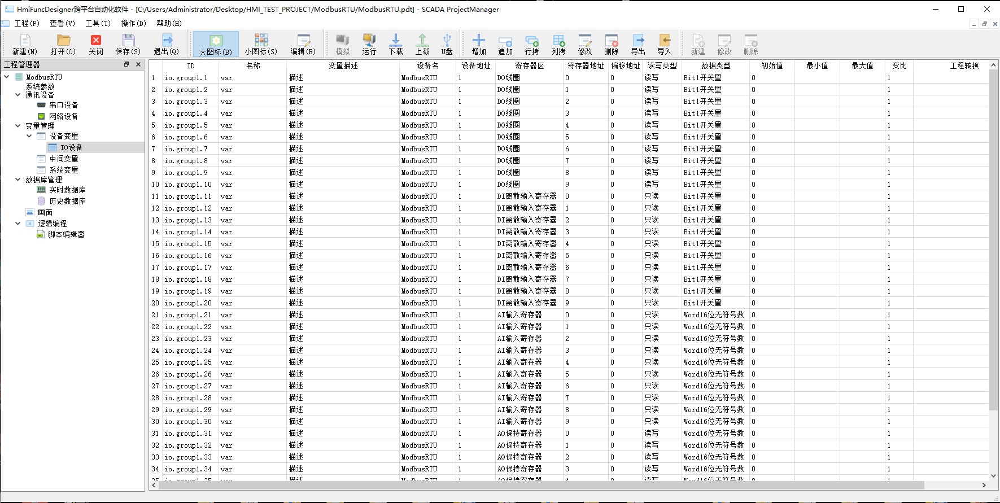
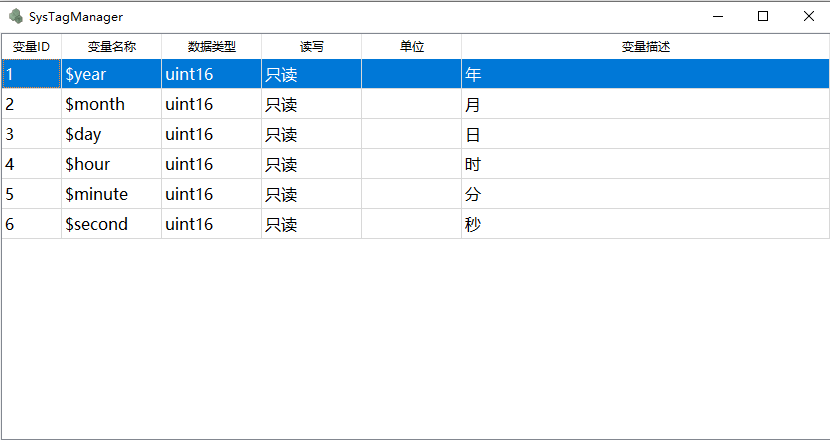
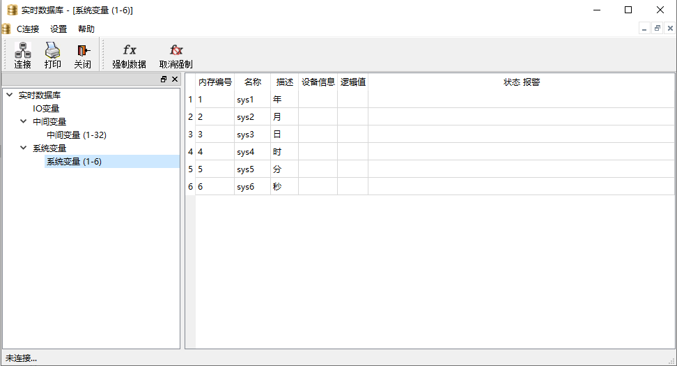
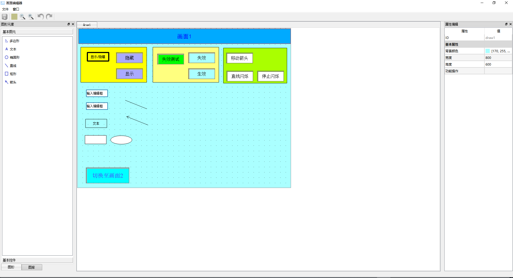
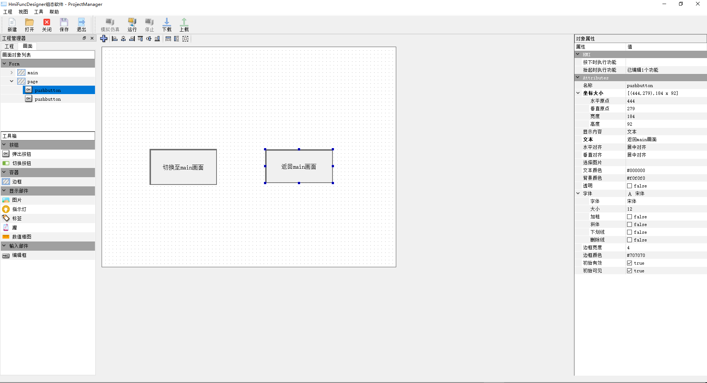
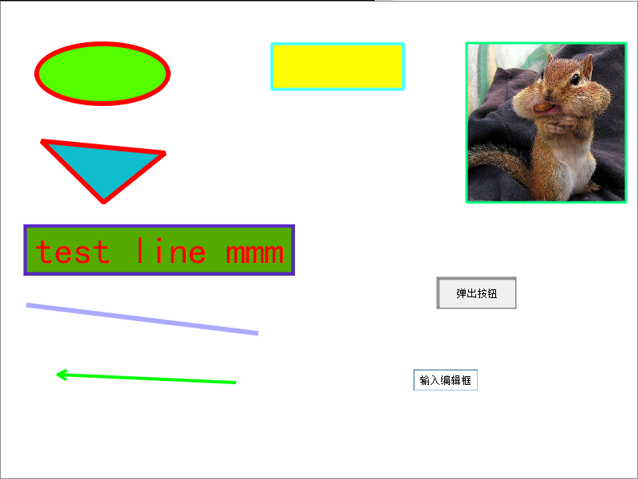
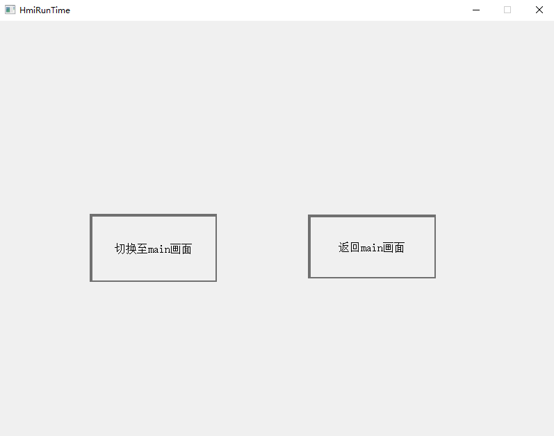

## 简介 Brief introduction

​	**QStudioSCADA是一款集HMI，数据采集于一体的软件，开源旨在技术分享、相互学习、提升技术。目前软件处于开发中，功能不完善，很多代码也需要重构，但是我相信在不久的将来本软件功能会更加完善！如果这份代码有幸被你看到了，而且对此也有兴趣，那么期待你的加入！！**

### 1. 代码下载 How to download QStudioSCADA code
  1. **打开Git Bash命令行工具， 执行 git clone https://github.com/VelsonWang/QStudioSCADA.git 克隆代码至本地目录。**
  2.  **同步远端更新代码至本地，执行 git pull origin。**

### 2. 软件环境 Software development environment

​	1.**Qt5.10.1 + MinGW530_32** 

​	2.**软件安装时必须包含Qt Script 模块**

​	3.**如果需要在Visual Studio下编译并不产生乱码，请参考文档 (doc/Visual Studio utf8-NOBOM.docx)**

### 3. QStudioSCADA软件编译 How the QStudioSCADA compiles

 1. **打开"Qt Creator 4.5.1 (Community)"软件，打开QStudioSCADA/QStudioSCADA.pro工程。**

 2. **选择Release模式。**

 3. **清除以前编译工程产生的数据文件。**

 4. **重新编译工程。**

 5. **编译完成功后生成的软件位于QStudioSCADABin/bin目录下。**

 6. **拷贝所需要的运行库，打开命令窗口“Qt 5.10.1 for Desktop (MinGW 5.3.0 32 bit)”，QStudioSCADABin/bin目录，执行windeployqt 软件名称.exe。**

    **具体操作如下图所示：**

    

​	

### 4. QSCADARunTime软件编译 How the QSCADARunTime compiles

1. **必须先编译QStudioSCADA然后再编译QSCADARunTime工程。否则会出现找不到连接库。**

2. **打开"Qt Creator 4.5.1 (Community)"软件，打开QSCADARunTime/QSCADARunTime.pro工程。**

3. **选择Release模式。**

4. **清除以前编译工程产生的数据文件。**

5. **重新编译工程。**

6. **编译完成功后生成的软件位于RuntimeBin目录下。**

7. **拷贝所需要的运行库，打开命令窗口“Qt 5.10.1 for Desktop (MinGW 5.3.0 32 bit)”，RuntimeBin目录，执行windeployqt 软件名称.exe。**

   

### 5. QStudioSCADA工程管理器 ProjectManager QStudioSCADA

**工程管理器具有如下功能：**

1. **系统参数，设置与运行有关的参数。**

2. **通讯设备，建立通信链路和协议。**

3. **数据库配置，建立系统IO变量表，并操作存盘、报警、转换等处理。**

4. **数据库管理，运行中的实时内存数据和SQL数据管理监视。**

5. **画面，建立系统画面。**

6. **逻辑编程，JavaScript编程。**

    

### 6.系统变量管理器 System variable manager

### 7.实时数据库显示 Real-time database data display

### 8.画面编辑 Graphic control editor

### 9. 画面解析运行 Run the designed UI

### 10. 支持的通信协议  Supported communication protocol

1.**Modbus RTU**

2.**Modbus ASCII**

3.**Modbus TCPIP**

4.**Mitsubishi Fx**

### 11. 联系方式  Contact

**Email：VelsonWang@qq.com**

**QQ:706409617**

**QQ交流群:568268522**

